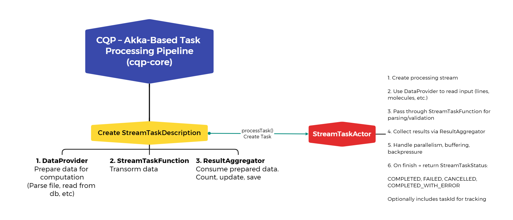

# Chem Query Platform Demo

This repository contains a **chem-query-platform-demo** showcasing how to use the [`chem-query-platform`](https://github.com/quantori/chem-query-platform) library.

## Overview

The goal of this project is to demonstrate the configuration and execution of an **Akka-based asynchronous data processing pipeline** using the `chem-query-platform` library.

With this library, you can easily define and orchestrate a highly scalable and fault-tolerant data flow in an **Akka cluster environment**.

This demo specifically showcases a simple analyzer for an SDF (Structure Data File). Using interfaces such as `TaskDescriptionSerDe`, `ResultAggregator`, and `DataProvider`, it demonstrates a pipeline that processes an SDF file and counts the number of molecules contained within.

Additionally, this demo showcases:
- **Molecule persistence and search**: Saving and searching molecular data using MOL structures in Elasticsearch, implemented via the `cqp-storage-elasticsearch` module.
- **Molecular structure parsing and transformation**: Parsing and transforming molecular structures using Indigo, with implementation and configuration provided by the `cqp-api` module.

## Features

- 🧪 Example integration of `chem-query-platform`
- ⚙️ Configurable Akka-based pipeline setup
- ⚡ Asynchronous data stream processing
- ☁️ Cluster-ready architecture using Akka Cluster
- 🧬 Demonstrates SDF file upload, library and molecule save to elastic-search

---

## Architecture

The diagram below illustrates the architecture of the CQP Akka-based task processing pipeline.  
It shows how a `StreamTaskDescription` is constructed, how the core components (`DataProvider`, `StreamTaskFunction`, `ResultAggregator`) interact, and how the `StreamTaskActor` persists the task results to the database.



---

## Demo Architecture

This demo illustrates how to use three main CQP libraries—`cqp-core`, `cqp-api` and `cqp-storage-elasticsearch`—to upload, process and search chemical data.

### 1. Upload Endpoint

**POST** `/api/v1/upload`
- **Request**: multipart/form-data ZIP archive containing one or more `.sdf` files.
- **Response**: a JSON object with a generated `fileId` (UUID), which you will use in subsequent searches.

Once the request is received, an **asynchronous Akka pipeline** is built using `cqp-core`:

1. **Task Descriptions**  
   The pipeline is configured with a collection of `StreamTaskDescription` instances:
    - `PropertiesValidator`
    - `CreateLibrary`
    - `MoleculeUpload`

2. **Pipeline Execution**  
   These descriptions are passed to the StreamTaskService, which instantiates one Akka Actor per task. These actors run sequentially, passing the processing state from one stage to the next.

3. **Molecule Persistence**  
   In the `MoleculeUpload` stage, each molecule is parsed with **[Indigo](https://github.com/epam/Indigo)** (`com.epam.indigo:indigo`), using the implementations provided in `cqp-api`.  
   Molecule and library metadata are then stored in Elasticsearch via the `cqp-storage-elasticsearch` module’s services.

### 2. Search Endpoint

**POST** `/api/v1/search`
- **Request**:
    - `molFile`: a single `.mol` file (as multipart/form-data)
    - `queryConfig`: JSON body, e.g.:

      ```json
      {
        "fileIds": [
          "1a0fecca-271a-43eb-bf06-37182188097a"
        ],
        "similarity": {
          "min": 0.8,
          "max": 1.0,
          "metric": "tanimoto"
        },
        "type": "similarity"
      }
      ```

- **Response**: search hits matching the chemical structure, filtered and sorted per the `queryConfig`.

The demo uses a **synchronous** call for simplicity (though `cqp-core` supports fully asynchronous APIs). Upon request:

1. The `.mol` file is parsed with Indigo.
2. A `StorageRequest` (from `cqp-core`) is built, incorporating any filters, similarity metrics and sorting options.
3. Results are fetched from Elasticsearch and returned to the client.

> **Note:** This example demonstrates only the core filtering options. You can extend it to leverage the full power of `StorageRequest`—including range filters, pagination, custom sort orders, and more.

---

## Getting Started

> Note: This is a demo repository. Make sure to clone and explore the [`chem-query-platform`](https://github.com/your-org/chem-query-platform) for full library documentation.

### Prerequisites

- JDK 17
- Gradle 8+
- PostgreSQL (used for data storage via Slick)
- Docker (optional for running PostgreSQL or simulating an Akka cluster)
- ElasticSearch

### Running the Demo

```bash
gradle clean build
docker-compose up --build
